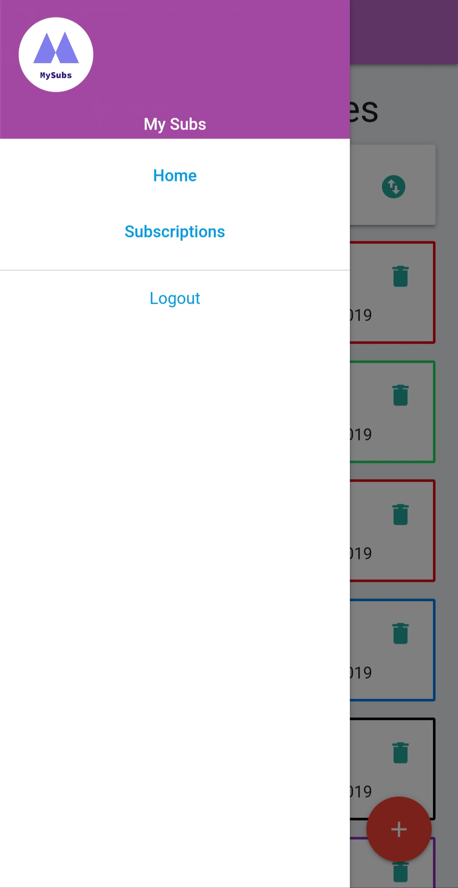
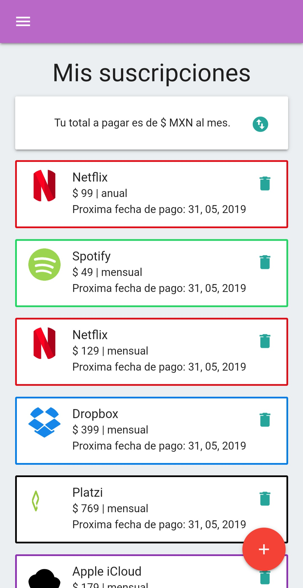
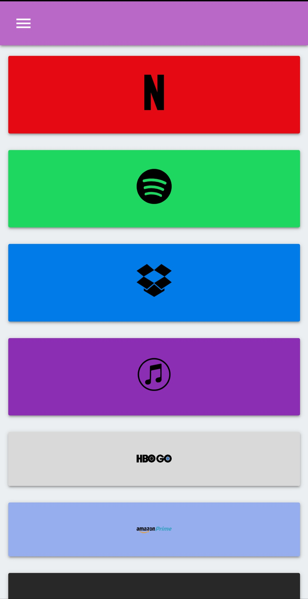
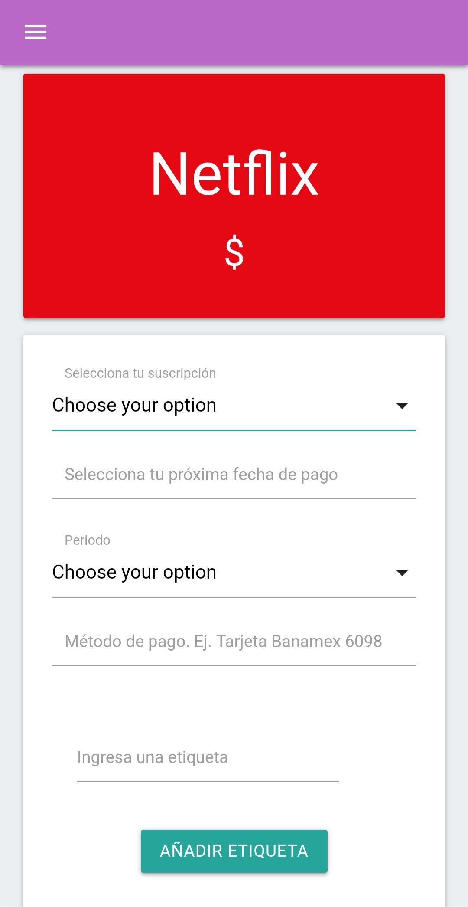

# MySubs
MySubs is an app to manage all your subscriptions. Optimized to mobile so please open in mobile view.
MySubs is not a simple form like any other app in Google Play, every subscription has its own subscriptions plans so every form is totally personalized.

 
 
 
 

###### Backend

It's built using Node.js, MongoDB, Express.js and Passport.js for auth.

###### Frontend

Built using Javascript(ES6), React and Axios.

## Installation

Clone this repo

```
git clone ...

```

Configure the environment variables using your text editor of choice (use the .env.example)

```
code .env
```

Install dependencies and start the server

```
yarn install
yarn start
```


